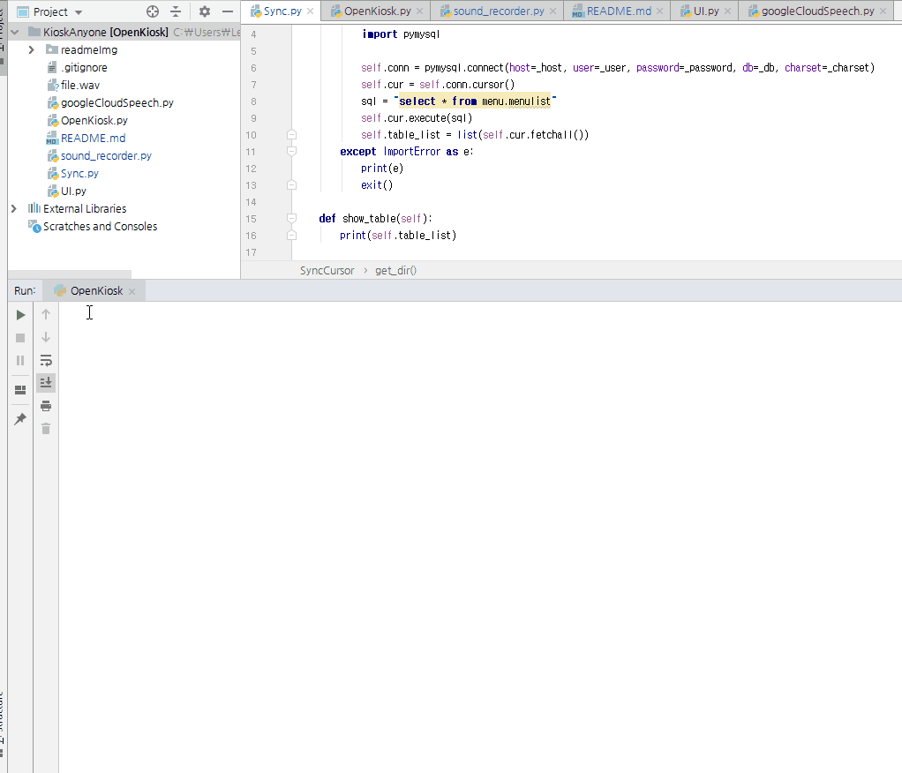
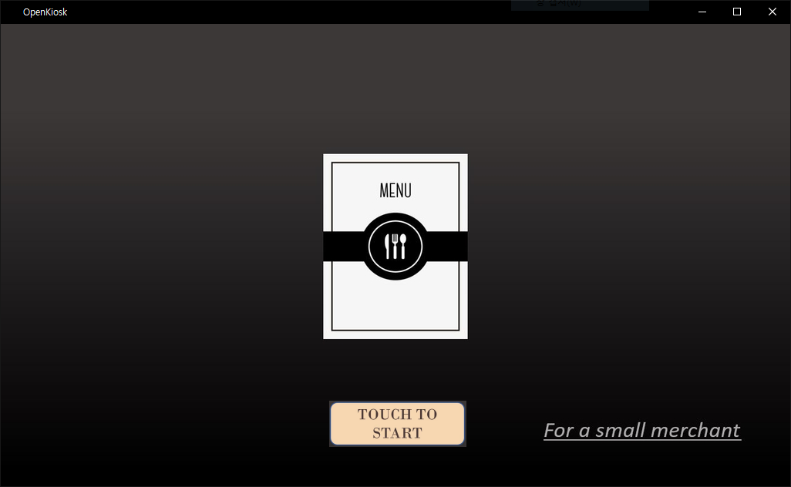
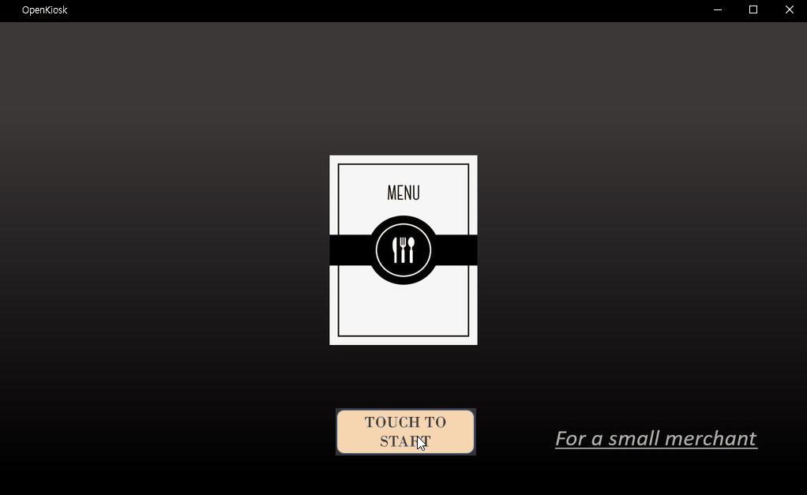
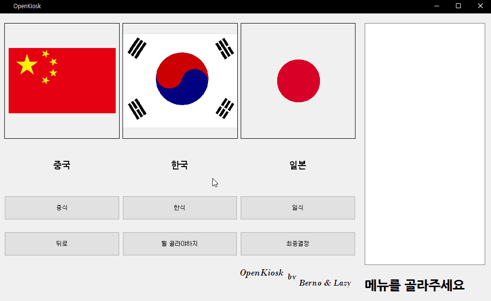
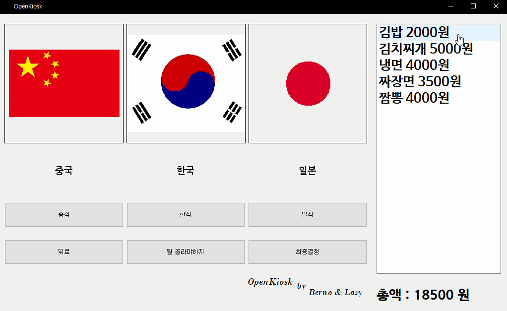
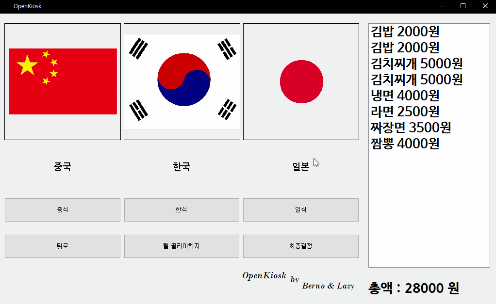
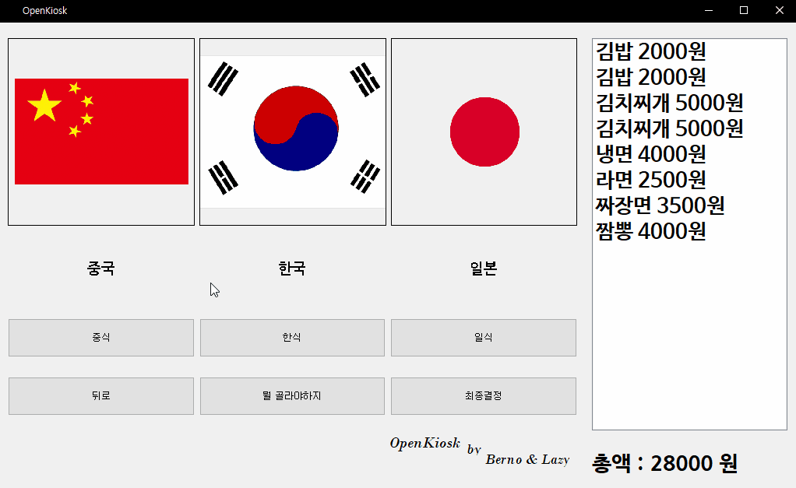
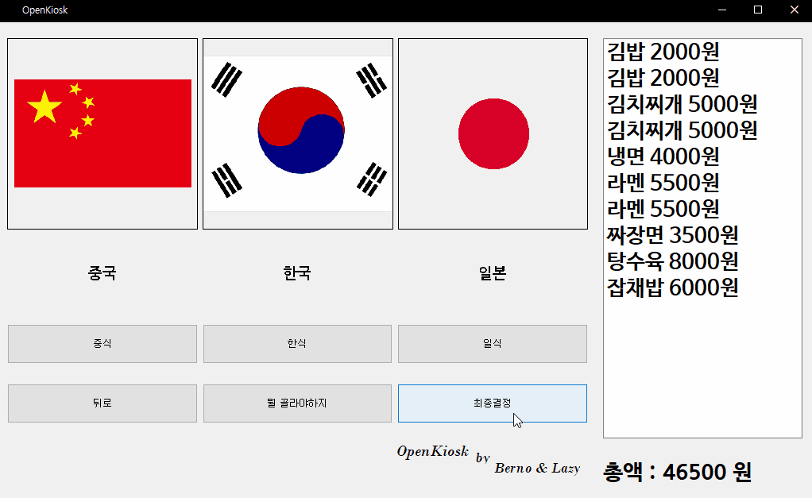
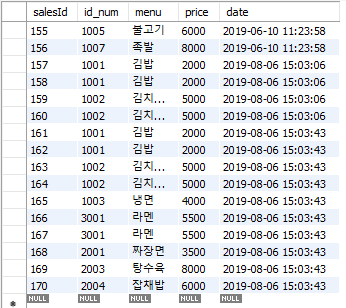

# OpenKiosk(2019년이전 이름 : KioskAnyone)
- Lazy_Lee 공부를 위해 해보는 프로젝트  Leizy -> Lazy
- 시중에 나와있는 값비싼 키오스크를 대신 할 저렴하면서 효율적인 키오스크를 만들어보자

---
외부 환경에서 파이썬2, 3버전이 *동시에 존재할때* 3 pip 쓰는 방법  
python3 -m pip install --upgrade pip  
---

# 사용한 모듈
 - pyqt5(remake project) GUI 구현
 - pymysql               MySQL 연동
 - Pyaudio               마이크 음성 입력
 - GoogleAPI             마이크의 음성을 텍스트로 바꿔줌
  
  
### 프로젝트 파일
+ OpenKiosk.py
    - 프로젝트 mian 파일
    - GUI 버튼의 이벤트 처리 구현
    - GUI 소스는 미리 컴파일 해둔 'UI.py'를 사용
  
+ UI.py
    - QtDesigner를 통해 만든 UI파일을 컴파일하여 만든 GUI 정보가 담긴 파일  
  
+ Sync.py
    - (SyncCursor)DB와 연결을 도와주며 프로그램 구동에 필요한 데이터를 컴퓨터에 설치하는 객체
    - 초기 구동이 확인되면 res라는 리소스 폴더를 생성하여 DB의 데이터와 동기화 작업을 시켜줌(Sync인 이유)

+ sound_recorder.py
    - 마이크로부터 음성 데이터를 받아 file.wav 로 저장시켜줌

+ googleCloudSpeech.py
    - 구글 API를 이용한 파일
    - sound_recorder.py 에서 입력받은 음성 데이터를 텍스트 파일로 바꿔주는 역할을 함

  
### 프로그램 동작
+ 초기 동작
    1. 처음 프로그램을 실행시키면 필요한 리소스 파일이 있는지 검사합니다.
    2. 만약 없다면 아래 영상과 같이 DB를 통하여 res폴더를 생성 한 후 데이터를 저장시킵니다.
    
    3. 첫 실행 이후부터는 간단한 검사를 마친 후 프로그램이 실행됩니다.
    
    
+ 메뉴 선택
    1. TOUCH TO START 버튼을 통해 진입하시면 원하시는 국가를 선택하실 수 있습니다.
    
    2. 원하시는 메뉴를 하단에 보이는 버튼을 통해 메뉴를 고르시면 우측에 선택된 메뉴가 나타나게 됩니다.
    
    3. 희망하지 않는 메뉴는 2번 클릭하여 해당 메뉴를 취소할 수 있습니다.
    
    4. 최종결정 버튼을 누르시면 메뉴가 정리되어 한번에 나타나게 됩니다.
    
    5. 그리고 뒤로 버튼을 눌러 취소 및 초기화 작업을 진행할 수 있습니다.
    
    + 메뉴 추천 기능
        - 소비자가 음식을 고민하는 부분을 해결하기 좋아하는 취향을 골라 메뉴를 추천해주는 시스템을 구성함(음성인식 추가)
        - https://www.youtube.com/watch?v=p56pmwAUSjA
        - 유튜브 영상 첨부가 안되니 위 링크를 참조 바람(직접 찍은 작동 영상)
+ 최종 확인
    1. 최종결정 이후 한번 더 클릭을 하시면 리스트가 초기화되면서 해당 항목은 DB에 매상테이블에 기록이 됩니다.
    
    
   
    
    
### 기대효과
1. 현재 시중에 사용되는 키오스크의 가격은 최소 100만원으로 구성되어있으며, 본 프로젝트는 라즈베리파이를 활용하기 때문에 30만원에 구성할수 있습니다.
2. 소상공인 및 다중 키오스크로 운영되는 상가에 보급이 용이합니다.
3. 유지보수 비용이 저렴합니다.(고장난 모듈만 고치면 되기 때문.ex_ 버튼-> 500원)

### 미구현 과제
1. 디자인이 빈약하고 음성인식 부분이 매끄럽지가 않기 때문에 전문 인력을 더 투입하여 자연스러운 대화식 구성을 구현하기 위해 노력하겠습니다.

## 2018-09-28
- GUI를 대폭 수정
- 기존에 Text 파일에서 불러오는 데이터를 DB로 수정
- 코드 최적화

## 2018-11-09 
- GUI 결제창 개선
- DB 종료시 나타나는 에러 개선
- 기존에 1개의 메뉴만 고르는 프로그램에서 N개의 메뉴로 확장

## 2019-03-12
- GUI 코드 다시 작성함
- 다시 다 갈아엎음

## 2019-04-14
- GUI 클래스로 덮어 쓰는중
- 구글 API를 이용해서 음성인식을 통한 메뉴 검색 모듈을 만듦
- DB 접근과 DB 관리 모듈을 새롭게 만들어 이제 불러오기 뿐만 아닌 수정까지 가능함(물론 아직은 본 프로젝트 한정)
- DB 모듈은 나중에 따로 다듬어서 저장소에 올릴 

## 2019-04-16
- GUI 클래스 덮어쓰기는 끝
- 이미지가 안나오던거 수정함
- 왼쪽에 계산목록 나오게 수정중

## 2019-04-17(오전)
- ...아무래도 Tk에서 Qt로 바꿔야 할거같다...

## 2019-04-17(오후)
- Qt사용법 알아냄! 존나좋음!

## 2019-04-18
- UI 전환 성공
- 음성인식부분까지 접목 완료
- 내일 음성인식부분 화면 더 가꾸는걸로

## 2019-04-19
- 기능 구현은 끝
- 근데 왜 exe 파일로는 실행이 안될까

## 2019-04-29
- 시험도 끝나고 생각해봤는데 왜 굳이 exe로 만들어야할까 이건 파이썬인데
- 그래서 그냥 라때판다 시리얼 통신으로 넘어갈까 생각중
- 점점 일기가 되어가는 일간 기록

## 2019-05-10
- 망했어요. 라때판다 터치스크린을 산 줄 알았는데 터치 패널을 사버렸어요.
- 하.. 일단 사비로 질렀는데 다음주에 온다네 미친!

## 2019-05-26
- 바빠요... 정말 바뻐....
- 좀 간결하게 정리했어요

## 2019-06-??
- 캡스톤 A+ 나왔습니다. 개꾸르
